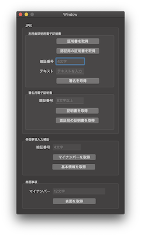

# MyNumberApp

これは [CryptoTokenKit Framework](https://developer.apple.com/documentation/cryptotokenkit) を使用してマイナンバーカードの情報を参照する macOS 用アプリケーションです。

このアプリケーションは Swift からスマートカード (ICカード) の各機能にアクセスするサンプルコードを提供する目的で作成しています。
そのため、マイナンバーカードについては必要最低限の機能のみ実装してあります。

マイナンバーカードについては詳細な仕様が公開されていないため、既に解析されている方々の[記事とソースコード](#謝辞)を参考に実装しました。
解析にかかる多大な努力と情報の公開に深く感謝します。

## 機能
- [x] CryptoTokenKit を使用した スマートカード (ICカード) アクセス
- [x] マイナンバーカードの各種証明書を取得
- [x] マイナンバーカードで署名の実施・取得
- [x] マイナンバーカード券面事項の取得

## 環境

* macOS 10.14+
* Xcode 10.2+
* Swift 5.0+
* IC カードリーダー

## スクリーンショット

## 作成者

Watanabe Toshinori – toshinori_watanabe@tiny.blue

## ライセンス

このプロジェクトは MIT ライセンスで公開しています。詳しくは [LICENSE](LICENSE) を参照してください。

## 謝辞

このアプリを作成するにあたり、以下の記事とソースコードを参考にしました。

*  [マイナンバーカード検証#1 - まえおき](https://qiita.com/gebo/items/6a334b5453817a587683)
*  [マイナンバーカード検証#2 - 利用者証明用電子証明書](https://qiita.com/gebo/items/fa35c1f725f4c443f3f3)
*  [マイナンバーカード検証#3 - 署名用電子証明書&Library JPKI Reader](https://qiita.com/gebo/items/37fcb50565c5ebeacb7b)
*  [Ludovic Rousseau's blog: PCSC sample in Swift](https://ludovicrousseau.blogspot.com/2015/09/pcsc-sample-in-swift.html)
*  [myna - マイナンバーカード・ユーティリティ](https://github.com/jpki/myna)
*  [JPKIReader](https://github.com/gebogebogebo/JPKIReader)
*  [マイナンバーカードドライバー](https://github.com/aruneko/WebUSB-MyNumberCard)
